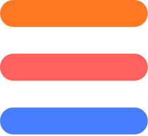

<h1>
  <a href="">
    
    Acervo de Estudos em Cloud Computing
   </a>
</h1>

Domine as principais plataformas e conceitos de computação em nuvem, com foco em AWS, Azure, GCP e boas práticas para infraestrutura escalável e segura.

<table>
  <thead>
    <tr>
      <th>Logo</th>
      <th>Provedor</th>
      <th>Descrição</th>
      <th>Acesso</th>
    </tr>
  </thead>
  <tbody>
  <tr>
    <td>
      

        ☁️
      

    </td>
    <td>
      <strong>Fundamentos de Cloud Computing</strong>
    </td>
    <td>Conceitos essenciais de computação em nuvem: modelos de serviço (IaaS, PaaS, SaaS), deployment, arquitetura e economia cloud.</td>
    <td>
      
    </td>
  </tr>
    <tr>
      <td>
        

          
        

      </td>
      <td><strong>Amazon Web Services (AWS)</strong></td>
      <td>Certificações e guias completos da plataforma líder em cloud computing. Níveis Practitioner, Associate, Professional e Specialty.</td>
      <td></td>
    </tr>
    <!-- <tr>
      <td>

        
      

      </td>
      <td><strong>Google Cloud Platform (GCP)</strong></td>
      <td>Certificações e recursos do Google Cloud: BigQuery, Kubernetes Engine, AI/ML, arquitetura e melhores práticas GCP.</td>
      <td></td>
    </tr> -->
    <!-- <tr>
      <td>

        
      

      </td>
      <td><strong>Microsoft Azure</strong></td>
      <td>Certificações Azure (AZ-104, AZ-204, AZ-305): Administrator, Developer, Solutions Architect e serviços Azure fundamentais.</td>
      <td></td>
    </tr> -->
    <!-- <tr>
      <td>

        
      

      </td>
      <td><strong>Infraestrutura como Código (IaC)</strong></td>
      <td>Automação de infraestrutura com Terraform, CloudFormation, Ansible, Pulumi e práticas modernas de IaC.</td>
      <td></td>
    </tr> -->
    <!-- <tr>
      <td>

        
      

      </td>
      <td><strong>Containerização e Orquestração</strong></td>
      <td>Docker, Kubernetes, Helm, service mesh e estratégias de deployment em containers para ambientes cloud-native.</td>
      <td></td>
    </tr> -->
    <!-- <tr>
      <td>

        
      

      </td>
      <td><strong>Boas Práticas em Cloud</strong></td>
      <td>Segurança cloud, Well-Architected Framework, otimização de custos, governança e design patterns para arquiteturas resilientes.</td>
      <td></td>
    </tr> -->
  </tbody>
</table>

  

**[⬅️ Voltar para a biblioteca principal](../)**
