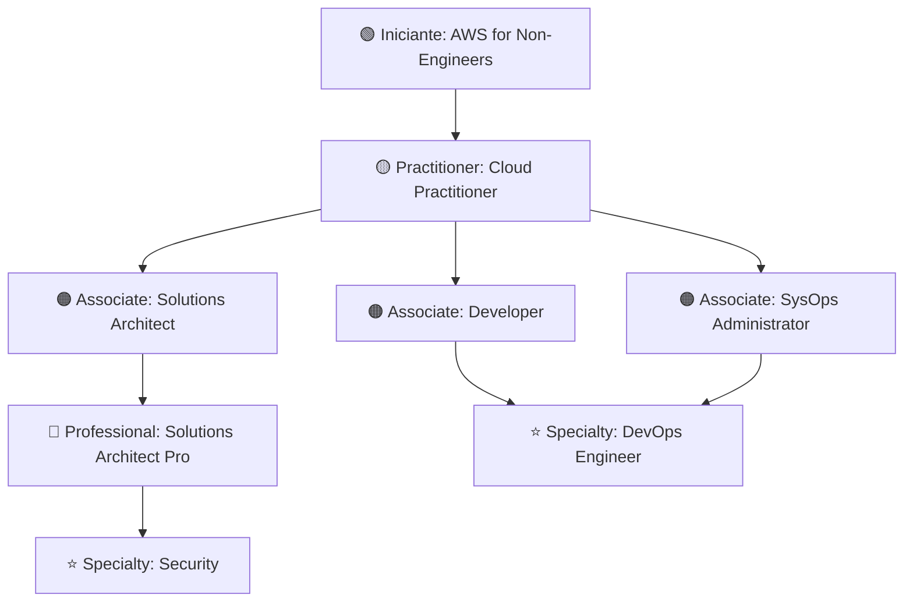

<h1>
  <a href="" >
    
    AWS | Amazon Web Services
   </a>
</h1>

Biblioteca completa de certificações e guias AWS, organizados por nível de conhecimento — desde fundamentos até certificações profissionais avançadas.

### 📚 Livros Disponíveis

<table>
  <thead>
    <tr>
      <th>Nível</th>
      <th>Título do Livro</th>
      <th>Autor(es)</th>
      <th>Download</th>
    </tr>
  </thead>
  <tbody>
    <!-- NÍVEL INICIANTE -->
    <tr>
      <td rowspan="2"><strong>🟢 Iniciante</strong></td>
      <td>AWS for Non-Engineers</td>
      <td>Hiroko Nishimura</td>
      <td></td>
    </tr>
    <tr>
      <td>AWS For Beginners - The ultimate guide to the fundamentals of aws</td>
      <td>Steve M Burnett</td>
      <td></td>
    </tr>
    <!-- NÍVEL PRACTITIONER -->
    <tr>
      <td><strong>🟡 Practitioner</strong></td>
      <td>AWS Certified Cloud Practitioner Exam</td>
      <td>Jon Bonso and Adrian Formaran</td>
      <td></td>
    </tr>
    <!-- NÍVEL ASSOCIATE -->
    <tr>
      <td rowspan="3"><strong>🟠 Associate</strong></td>
      <td>AWS Certified Developer Associate Exam</td>
      <td>Jon Bonso and Adrian Formaran</td>
      <td></td>
    </tr>
    <tr>
      <td>AWS Certified Solutions Architect Associate SAA-C03</td>
      <td>Jon Bonso</td>
      <td></td>
    </tr>
    <tr>
      <td>AWS Certified SysOps Administrator Associate Version 2</td>
      <td>Jon Bonso and Lervin John Obando</td>
      <td></td>
    </tr>
    <!-- NÍVEL PROFESSIONAL -->
    <tr>
      <td rowspan="2"><strong>🔴 Professional</strong></td>
      <td>AWS Certified Solutions Architect Professional</td>
      <td>Jon Bonso and Adrian Formaran</td>
      <td></td>
    </tr>
    <tr>
      <td>AWS Certified DevOps Engineer - Professional Certification and Beyond</td>
      <td>Adam Book</td>
      <td></td>
    </tr>
    <!-- NÍVEL SPECIALTY -->
    <tr>
      <td rowspan="2"><strong>⭐ Specialty</strong></td>
      <td>AWS Certified DevOps Professional Engineer</td>
      <td>Jon Bonso and Kenneth Samonte</td>
      <td></td>
    </tr>
    <tr>
      <td>AWS Certified Security Specialty Exam</td>
      <td>Jon Bonso and Carlo Acebedo</td>
      <td></td>
    </tr>
  </tbody>
</table>

---

## 🎯 Trilha de Aprendizado Recomendada

### Legenda dos Níveis

- **🟢 Iniciante**: Introdução à AWS para quem está começando
- **🟡 Practitioner**: Fundamentos da AWS Cloud
- **🟠 Associate**: Certificações de nível intermediário (Developer, Architect, SysOps)
- **🔴 Professional**: Certificações avançadas com design e otimização de arquiteturas complexas
- **⭐ Specialty**: Especialização em áreas específicas (DevOps, Security, etc)

---

**Total de livros**: 10 | **Última atualização**: Janeiro 2026

**[⬅️ Voltar para Cloud](../)**
